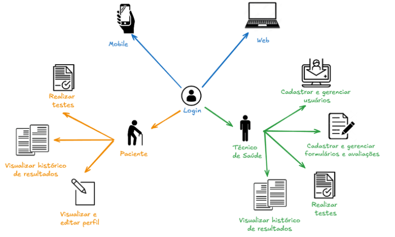

# TCC TecnoAging

Trabalho de Conclusão de Curso do curso de **Tecnologia em Análise e Desenvolvimento de Sistemas** da **Universidade Federal do Paraná (UFPR)**.

- O artigo do projeto e os artefatos de modelagem estarão disponíveis no acervo da Biblioteca da UFPR: https://bibliotecas.ufpr.br/

**Integrantes da Equipe**
- Eduardo Henrique Alberti Costa  
- Gabriel Chioquetta Obladen  
- Natasha Alcaide Santos  
- Thalyson Bruck Andreatta  

## Descrição do Projeto
O TecnoAging é um sistema integrado composto por uma plataforma web e um aplicativo móvel, voltado a profissionais de saúde e idosos. O objetivo é apoiar a avaliação e o acompanhamento da saúde da população idosa no Brasil, contribuindo para tornar esse processo mais padronizado, eficiente e acessível diante do cenário de envelhecimento populacional.


## Estrutura do Projeto
```plaintext
TelasTCC/
├── frontend/
│   ├── mobile/  # Aplicação móvel desenvolvida em Kotlin para Android.
│   └── web/     # Plataforma web desenvolvida com Angular.
├── backend/
│   ├── _Auth           # Microsserviço de Autenticação (Spring Boot, Java, MongoDB para tokens e credenciais).
│   ├── _Forms          # Microsserviço de Formulários (Spring Boot, Java, PostgreSQL para lógica de questionários).
│   ├── _Gateway        # API Gateway (Node.js para roteamento e autenticação centralizada).
│   ├── _Pacientes      # Microsserviço de Pacientes (Spring Boot, Java, PostgreSQL para dados de pacientes).
│   ├── _SAGA           # Microsserviço da SAGA Orquestrada (Spring Boot para orquestração de transações distribuídas).
│   ├── _Tecnicos       # Microsserviço de Técnicos (Spring Boot, Java, PostgreSQL para dados de técnicos).
│   └── Postman         # Arquivos variados de testes (ex: coleções Postman).
├── imgs/
    └── Arquitetura/    # Imagens da Arquitetura do Sistema
└── README.md           # Documentação do projeto.
```
## Arquitetura do sistema


## Funcionalidades Principais



## Tecnologias Utilizadas

O TecnoAging adota uma arquitetura baseada em microsserviços, garantindo escalabilidade, eficiência e integração entre os módulos.

* **Frontend Web**: Desenvolvido utilizando o framework Angular (v18.2.4) com TypeScript (v5.6.3). Esta escolha permite a criação de interfaces dinâmicas e intuitivas, com o conceito de Single Page Application (SPA), oferecendo uma experiência de usuário fluida e responsiva. A interface é projetada para assistentes de saúde.
* **Frontend Mobile**: Desenvolvido com Kotlin, uma linguagem moderna, multiplataforma e de código aberto, oficialmente suportada pelo Google para desenvolvimento Android desde 2017. Esta escolha se deu pela demanda por uma solução nativa com bom desempenho, integração com o sistema Android e controle sobre os elementos da interface.
* **API Gateway**: Implementado em Node.js, atua como um ponto intermediário único de entrada entre os clientes e o backend. É responsável por gerenciar o tráfego de requisições, roteamento dinâmico, autenticação centralizada, balanceamento de carga e controle de acesso.
* **Backend**: Implementado utilizando uma arquitetura baseada em microsserviços, desenvolvidos com Spring Boot em Java (v17). Cada microsserviço é responsável por uma funcionalidade específica e possui seu próprio banco de dados, garantindo independência e flexibilidade. Os principais microsserviços são: MS Técnicos, MS Pacientes, MS Formulários (utilizando PostgreSQL) e MS Auth (utilizando MongoDB).
* **Comunicação Assíncrona**: Utiliza o RabbitMQ, um sistema de mensageria de código aberto baseado no protocolo AMQP (Advanced Message Queuing Protocol), para a troca de mensagens entre os diferentes componentes do sistema distribuído.
* **Contêineres**: O Docker é utilizado para automatizar a criação, implantação e execução de aplicativos em contêineres, isolando os microsserviços e suas dependências.
* **Banco de Dados Relacional**: PostgreSQL é utilizado pelos microsserviços MS Técnicos, MS Pacientes e MS Formulários para armazenar dados estruturados e transações complexas, oferecendo robustez e recursos avançados.
* **Banco de Dados Não Relacional (NoSQL)**: MongoDB é a escolha para o MS Auth, que gerencia a autenticação e autorização de usuários, lidando com esquemas dinâmicos e não estruturados, como tokens de autenticação e informações de sessão.
* **Modelagem**: A modelagem do sistema utilizou diagramas UML (Unified Modeling Language) — incluindo diagramas de casos de uso, classes e sequência — criados através da ferramenta Astah.


## Metodologia de Desenvolvimento

O projeto TecnoAging foi desenvolvido utilizando o framework ágil Scrum, com adaptações específicas para a equipe. Essa metodologia foi escolhida por sua abordagem iterativa e incremental, permitindo entregas frequentes e validação contínua.

### Etapas do Projeto
1.  **Modelagem e Planejamento**: A primeira etapa do projeto envolveu sprints semanais dedicadas à modelagem e planejamento do sistema. Durante este período, foram elaborados diagramas UML, histórias de usuário, protótipos de telas e uma prova de conceito (PoC) baseada no questionário IVCF-20.
2.  **Desenvolvimento**: Após a modelagem, o projeto seguiu para a fase de desenvolvimento, com sprints quinzenais focadas na implementação das funcionalidades. As funcionalidades foram implementadas por prioridade.

## Como Rodar o Backend (Docker)

Para construir e levantar todos os serviços do backend utilizando Docker, siga os passos abaixo:

1.  Navegue até o diretório `backend/` no seu terminal.
2.  Execute o seguinte comando:
    ```bash
    docker-compose up --build
    ```
    Este comando irá construir as imagens Docker necessárias e iniciar todos os contêineres definidos no `docker-compose.yml`, incluindo os microsserviços e os bancos de dados.


